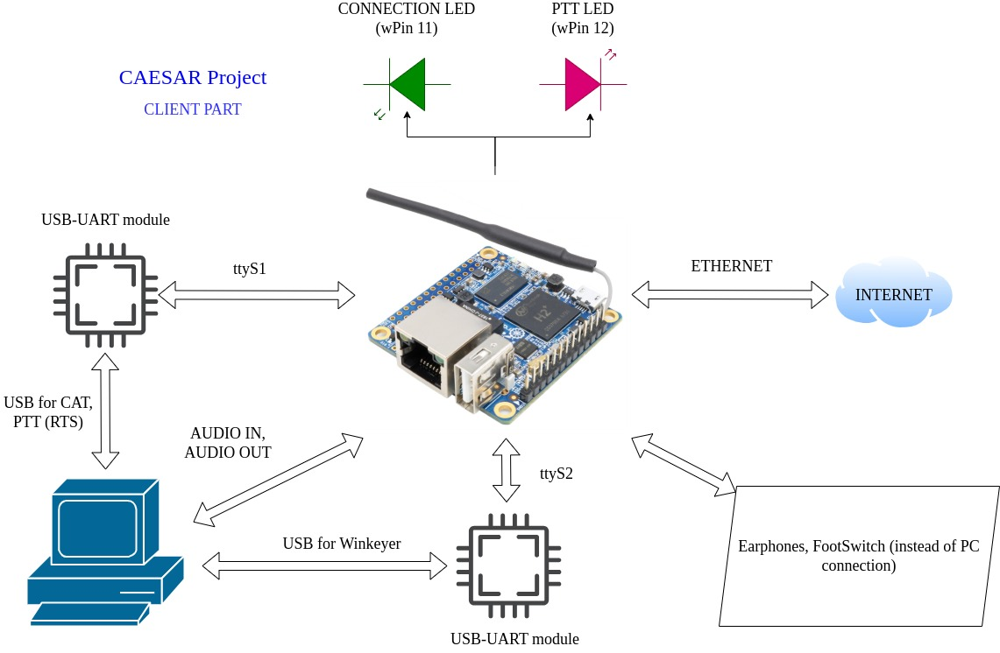

## Control Automatic Environment for Sound And Radio (CAESAR Project)


## Ports

* `UDP 5000` - Audio stream from server to client
* `UDP 5002` - Audio stream from client to server
* `UDP 5001` - PTT control
* `UDP 5003` - check connection from server to client
* `UDP 5004` - check connection from client to server
* `UDP 3001` - cat control via USB-TTL (`ttyUSB0`)
* `UDP 3002` - WinKeyer control via USB-TTL (`ttyUSB1`)

Serial port for CAT - 19200 kb/s, 8N1

Serial port for WinKeyer - 1200 kb/s, 8N2

## Files

`install_server.sh` - install all dependencies for server


## Installation

* First of all you need to create SD-card for your orange pi zero.  
 Here is the [Armbian img](http://ra0sms.com:8000/img/Armbian_community_25.5.0_minimal.tar.gz).  
You can create it with BalenaEltcher sotware - https://etcher.balena.io/  
After first Armbian starting (or ssh connection) you need to create user ```pi``` (don't forget about password)  
* All settings can be done via ```ssh``` connection (putty, for example, if you use Windows OS)  
* Connect to your orange pi via ```ssh```. You wiil be in ```HOME``` directory (```/home/pi/```).  
* Clone ```caesar_project``` from GitHub:  
   ``` bash
      git clone https://github.com/ra0sms/caesar_project.git 
      cd caesar_project
   ```  
* Before the next step you need to connect CAT interface and winkeyer in USB ports server's orange pi zero.  
* To install server - run ```sudo ./install_server.sh```  
   If you see some errors it can be connect with USB to Serial interfaces.  
   By default the script uses names ```ttyUSB0``` and ```ttyUSB1```. In your case it can be different. So you need to correct ```fix_usb_ports.sh``` script. 
   ```bash
    ls /dev/tty*
    # find your names (something like ttyACM0)
    nano ./fix_usb_ports.sh
    # put your names instead of ttyUSB0 and ttyUSB1
    sudo ./fix_usb_ports.sh
   ```  
* To install client - run ```sudo ./install_client.sh```  
* Then you need to write IP addresses for ```server``` and ```client``` 
   ```bash
      nano ./server_ip.cfg 
      nano ./client_ip.cfg
   ```  
* If ```server``` and ```client``` are not in one local network you need to do port forwarding (see [Ports](#ports)) on your router settings.  
* Reboot both orange pi zero.  
* If everything is done rigth you will see that LEDs "connection" on both devices are turn ON.  

   

## Orange Pi zero pinout

wPi `pin 11` - LED "Connection"

wPi `pin 12` - PTT input/output





